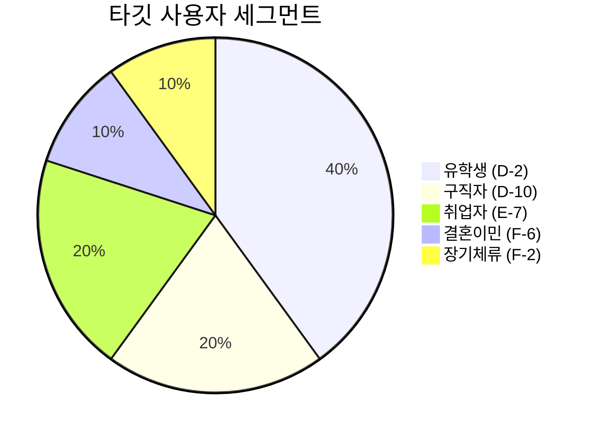

# 사용자 플로우 기반 웹사이트 개선 플랜

> 현재 UI/설계를 최대한 활용하면서 로그인/비로그인 플로우 및 사용자별 여정을 개선

---

## 1. 현재 시스템 분석

### 1.1 현재 아키텍처 (HANDOVER.md 기반)

```
┌─────────────────────────────────────────────────────────────┐
│ Atomic Design Pattern                                        │
├──────────────┬───────────────┬───────────────┬──────────────┤
│   atoms     │   molecules   │   organisms   │  templates   │
│ Avatar,     │ PostCard,     │ Header,       │ MainLayout   │
│ Badge,      │ NewsCard,     │ CategorySidebar│              │
│ Button      │ RichTextEditor│ PostList,     │              │
│             │               │ NewsSection   │              │
└──────────────┴───────────────┴───────────────┴──────────────┘
```

### 1.2 사용자 플로우 다이어그램 분석


**핵심 플로우 포인트:**

| 단계 | 비로그인 (N) | 로그인 (Y) |
|-----|-------------|-----------|
| **콘텐츠 접근** | 게시글 검색/열람 ✅ | 전체 기능 ✅ |
| **질문/답변** | ❌ 로그인 필요 | ✅ 작성 가능 |
| **인증 신청** | ❌ | Y → 서류 업로드 → 관리자 검토 |
| **배지/혜택** | ❌ | 인증 배지 + 답변 우선 노출 |
| **알림** | ❌ | 질문 답변/채택 알림 |

---

## 2. 사용자 페르소나별 여정

### 2.1 페르소나 정의



### 2.2 페르소나별 필요 기능

| 페르소나 | 핵심 니즈 | 필요 카테고리 | 현재 Gap |
|---------|----------|-------------|----------|
| **유학생** | TOPIK, 장학금, 아르바이트 | korean-language, education | 유학 토픽 분리 필요 |
| **구직자** | E-7 비자, 면접, 이력서 | visa, employment | 면접/이력서 서브카테고리 |
| **취업자** | 노동법, 이직, F-2-7 | legal, employment | 권리 보호 강화 |
| **결혼이민** | 체류, 육아, 문화 | daily-life, education | 다문화 특화 콘텐츠 |

---

## 3. 로그인/비로그인 플로우 개선

### 3.1 비로그인 사용자 (Guest) 플로우

```
┌─────────────────────────────────────────────────────────────┐
│ STEP 1: 첫 방문                                             │
├─────────────────────────────────────────────────────────────┤
│ • 메인 배너 (VietnamBanner) 노출                            │
│ • 카테고리 목록 (CategorySidebar) 열람                      │
│ • 인기글/최신글 리스트 (PostList) 열람                      │
│ • 뉴스 섹션 (NewsSection) 열람                              │
└─────────────────────────────────────────────────────────────┘
                            ↓
┌─────────────────────────────────────────────────────────────┐
│ STEP 2: 참여 시도                                           │
├─────────────────────────────────────────────────────────────┤
│ [현재] Action 버튼 클릭 → LoginPrompt 표시                  │
│ [개선] 로그인 CTA 강화 + 혜택 안내 모달                     │
│        "로그인하면 전문가 답변을 받을 수 있어요"            │
└─────────────────────────────────────────────────────────────┘
                            ↓
┌─────────────────────────────────────────────────────────────┐
│ STEP 3: 로그인                                              │
├─────────────────────────────────────────────────────────────┤
│ • Google OAuth (회원가입/로그인 통합)                       │
│ • 최초 로그인 시 프로필 완성 유도                           │
│ • 관심 카테고리 설정 유도                                   │
└─────────────────────────────────────────────────────────────┘
```

### 3.2 로그인 사용자 (Member) 플로우

```
┌─────────────────────────────────────────────────────────────┐
│ STEP 1: 온보딩 (첫 로그인)                                  │
├─────────────────────────────────────────────────────────────┤
│ [현재] WelcomeModal로 기본 안내                             │
│ [개선] FirstPostPromptModal 활용 + 관심 카테고리 설정       │
│        + QuickTour 스타일 가이드                            │
└─────────────────────────────────────────────────────────────┘
                            ↓
┌─────────────────────────────────────────────────────────────┐
│ STEP 2: 활동                                                │
├─────────────────────────────────────────────────────────────┤
│ • 질문하기: CategorySidebar → 질문 작성 버튼                │
│ • 공유하기: CategorySidebar → 경험 공유 버튼                │
│ • 답변하기: 게시글 상세 → 답변 작성                         │
│ • 팔로우: 작성자 프로필 → 팔로우 버튼                       │
└─────────────────────────────────────────────────────────────┘
                            ↓
┌─────────────────────────────────────────────────────────────┐
│ STEP 3: 성장 (Certified User)                               │
├─────────────────────────────────────────────────────────────┤
│ • 인증 신청: verification/request 페이지                    │
│ • 서류 업로드: 학생증/재직증명서 등                         │
│ • 관리자 검토 → 승인/거부                                   │
│ • 승인 시: isVerified 배지 + 답변 우선 노출                 │
└─────────────────────────────────────────────────────────────┘
```

### 3.3 관리자 (Admin) 플로우

```
┌─────────────────────────────────────────────────────────────┐
│ 관리자 기능 (이미 구현됨)                                   │
├─────────────────────────────────────────────────────────────┤
│ • /admin/users: 사용자 관리                                 │
│ • /admin/verifications: 인증 승인/거부                      │
│ • /admin/posts: 콘텐츠 관리                                 │
│ • /admin/news: 뉴스 관리                                    │
│ • /admin/notifications: 알림 발송                           │
└─────────────────────────────────────────────────────────────┘
```

---

## 4. 현재 컴포넌트 활용 개선

### 4.1 CategorySidebar 개선

**현재 구조:**
```
CategorySidebar
├── 카테고리 목록 (CategoryItem)
└── 액션 버튼 (질문하기, 공유하기, 인증 신청)
```

**개선안:**

| 영역 | 현재 | 개선 |
|-----|-----|-----|
| 카테고리 | 평면 목록 | **그룹별 접기/펼치기** |
| 비로그인 | 모든 버튼 활성 | 로그인 CTA 강조 |
| 로그인 | 기본 버튼 | **퀵 액션 + 통계** |

```tsx
// 개선된 CategorySidebar 구조
<CategorySidebar>
  {/* 그룹별 카테고리 */}
  <CategoryGroup label="생활정보" defaultOpen>
    <CategoryItem>한국 비자·체류</CategoryItem>
    <CategoryItem>한국에서 집 구하기</CategoryItem>
    ...
  </CategoryGroup>
  
  {/* 사용자 상태별 액션 */}
  {isLoggedIn ? (
    <ActionSection>
      <QuickStats posts={userStats.posts} answers={userStats.answers} />
      <ActionButton variant="question" />
      <ActionButton variant="share" />
      {!isVerified && <ActionButton variant="certification" />}
    </ActionSection>
  ) : (
    <LoginPromptSection onLogin={handleLogin} />
  )}
</CategorySidebar>
```

### 4.2 HomeClient 개선 (피드 탭 추가)

**현재 구조:**
```
HomeClient
├── VietnamBanner
├── CategoryFilter
├── PostList
└── NewsSection
```

**개선안:**

```tsx
// 레거시 패턴 참고한 피드 탭 추가
<HomeClient>
  <VietnamBanner />
  
  {/* 피드 탭 (레거시 HERO_TAB_ITEMS 참고) */}
  <FeedTabs activeTab={tab} onTabChange={setTab}>
    <FeedTab key="popular" icon="🔥" label="Popular" />
    <FeedTab key="latest" icon="⏰" label="Latest" />
    {isLoggedIn && <FeedTab key="following" icon="🤝" label="Following" />}
  </FeedTabs>
  
  {/* 조건부 피드 */}
  {tab === 'popular' && <PostList sort="popular" />}
  {tab === 'latest' && <PostList sort="latest" />}
  {tab === 'following' && <PostList filter="following" />}
  
  <NewsSection />
</HomeClient>
```

### 4.3 FirstPostPromptModal 활용

**현재:** 첫 글 작성 유도 모달
**개선:** 온보딩 가이드 통합

```tsx
// 단계별 온보딩으로 확장
<FirstPostPromptModal step={onboardingStep}>
  {step === 1 && <WelcomeStep />}
  {step === 2 && <InterestsStep onSelect={saveInterests} />}
  {step === 3 && <FirstActionStep />}
</FirstPostPromptModal>
```

---

## 5. 구현 우선순위

### Phase 1: Quick Wins (1~3일)

| 작업 | 컴포넌트 | 난이도 |
|-----|---------|-------|
| 레이아웃 간격 조정 | HomeClient | ⭐ |
| 로그인 CTA 강화 | LoginPrompt | ⭐ |
| 비로그인 Action 버튼 분기 | CategorySidebar | ⭐⭐ |

### Phase 2: 피드 시스템 (1주)

| 작업 | 컴포넌트 | 난이도 |
|-----|---------|-------|
| 피드 탭 추가 | HomeClient, FeedTabs | ⭐⭐ |
| Popular 정렬 API | /api/posts | ⭐⭐ |
| Following 필터 | PostList | ⭐⭐ |

### Phase 3: 온보딩 강화 (1주)

| 작업 | 컴포넌트 | 난이도 |
|-----|---------|-------|
| 관심 카테고리 설정 | FirstPostPromptModal | ⭐⭐ |
| 카테고리 구독 연동 | CategorySubscription | ⭐⭐⭐ |
| 구독 기반 피드 필터 | PostList | ⭐⭐⭐ |

### Phase 4: 마케팅 연동 (2주)

| 작업 | 컴포넌트 | 난이도 |
|-----|---------|-------|
| UTM 추적 | middleware.ts | ⭐⭐ |
| 랜딩 페이지 최적화 | 신규 | ⭐⭐⭐ |
| UGC 챌린지 지원 | 신규 | ⭐⭐⭐ |

---

## 6. 로드맵 타임라인

```
Week 1 ─────────────────────────────────────────────────────
├─ Day 1-2: 레이아웃/간격 수정, 로그인 CTA 강화
├─ Day 3-4: 피드 탭 UI 추가
└─ Day 5: 비로그인 플로우 테스트

Week 2 ─────────────────────────────────────────────────────
├─ Day 1-2: Popular 정렬 로직 구현
├─ Day 3-4: Following 필터 구현
└─ Day 5: 피드 시스템 통합 테스트

Week 3 ─────────────────────────────────────────────────────
├─ Day 1-2: 온보딩 모달 확장
├─ Day 3-4: 카테고리 구독 연동
└─ Day 5: 사용자 테스트

Week 4 ─────────────────────────────────────────────────────
├─ Day 1-3: 마케팅 연동 (UTM, QR)
├─ Day 4-5: 버그 수정 및 최적화
└─ 배포 준비
```

---

## 7. 성공 지표

| 지표 | 측정 방법 | 목표 |
|-----|----------|-----|
| **로그인 전환율** | 비로그인→로그인 | +30% |
| **첫 활동 전환율** | 로그인→첫 글/답변 | +40% |
| **Certified 신청율** | 로그인→인증신청 | +20% |
| **재방문율** | 7일 리텐션 | +35% |
| **피드 참여율** | 탭 전환/필터 사용 | 50%+ |
