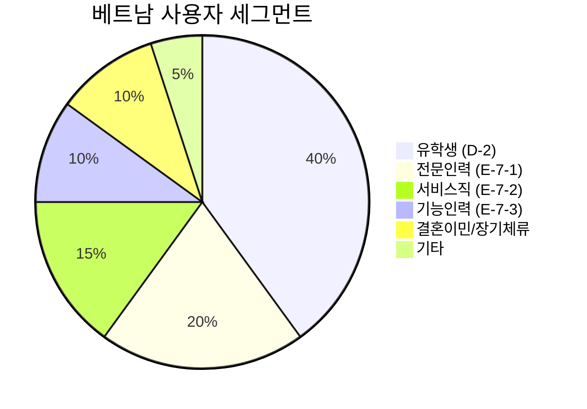

# 토픽-카테고리 적합도 비교 분석 보고서

## 1. 분석 개요

**분석 대상:**
- 현재 모델: `viet-kconnect-renew-nextjs-main 2` (14개 카테고리)
- 레거시 모델: `viet-kconnect 복사본 2` (22개 토픽-카테고리 매핑, 4개 그룹)
- 지식 문서: 비자 매칭 보고서, SNS 전략, 마케팅 플랜, 커뮤니티 현황

---

## 2. 현재 모델 (14개 카테고리)

| ID | 카테고리명 (KO) | 영역 |
|----|----------------|------|
| visa | 한국 비자·체류 | 법적/체류 |
| employment | 한국 직장생활 | 취업 |
| housing | 한국에서 집 구하기 | 생활 |
| korean-language | 한국어 배우기 | 교육 |
| daily-life | 한국 생활 정착 | 생활 |
| finance | 베트남 송금·금융 | 금융 |
| healthcare | 한국 의료 이용 | 생활 |
| legal | 외국인 근로자 권리 | 법적 |
| food | 베트남 음식·물품 | 문화 |
| culture-tour | 한국 문화 탐방 | 문화 |
| business | 한국에서 창업하기 | 취업 |
| education | 다문화 가정 육아 | 교육 |
| shipping | 베트남 물품 배송 | 생활 |
| cultural-exchange | 한-베 문화 교류 | 문화 |

---

## 3. 레거시 모델 (22개 토픽, 4개 그룹)

### 3.1 생활정보 그룹 (6개 토픽)

| 토픽 | 매핑 카테고리 | 키워드 |
|------|--------------|--------|
| 비자 | 한국 비자·체류 | visa, 체류, 이민, 외국인등록증 |
| 주거 | 한국에서 집 구하기 | 집, 전월세, 부동산 |
| 교통 | 한국 생활 정착 | 지하철, 버스, T-money |
| 은행 | 베트남 송금·금융 | 은행, 계좌, 송금, 환전 |
| 통신 | 한국 생활 정착 | 핸드폰, 유심, 인터넷 |
| 보험 | 한국 의료 이용 | 건강보험, 의료보험 |

### 3.2 취업·경력 그룹 (6개 토픽)

| 토픽 | 매핑 카테고리 | 키워드 |
|------|--------------|--------|
| 구직 | 한국 직장생활 | 일자리, 취업, 채용, 알바 |
| 이력서 | 한국 직장생활 | 이력서, 자기소개서 |
| 면접 | 한국 직장생활 | 면접, 인터뷰 |
| 회사생활 | 한국 직장생활 | 직장, 회사, 상사 |
| 노동법 | 외국인 근로자 권리 | 근로계약, 임금, 해고 |
| 창업 | 한국에서 창업하기 | 사업, 사업자등록 |

### 3.3 한국어·교육 그룹 (6개 토픽)

| 토픽 | 매핑 카테고리 | 키워드 |
|------|--------------|--------|
| 한국어학습 | 한국어 배우기 | 한국어, 공부, 학습 |
| TOPIK | 한국어 배우기 | 토픽, 한국어능력시험 |
| 유학 | 다문화 가정 육아 | 대학, 학교, 유학생 |
| 장학금 | 다문화 가정 육아 | 장학금, 학비 |
| 학교생활 | 다문화 가정 육아 | 학교, 교육, 학생 |
| 자격증 | 한국 직장생활 | 자격증, 면허, 시험 |

### 3.4 문화·여가 그룹 (4개 토픽)

| 토픽 | 매핑 카테고리 | 키워드 |
|------|--------------|--------|
| 음식 | 베트남 음식·물품 | 음식, 식당, 베트남음식 |
| 여행 | 한국 문화 탐방 | 여행, 관광, 축제 |
| 문화체험 | 한국 문화 탐방 | 문화, 체험, 전통 |
| 친구만들기 | 한국 생활 정착 | 친구, 커뮤니티, 모임 |

---

## 4. 비교 분석

### 4.1 구조적 차이

| 비교 항목 | 현재 모델 | 레거시 모델 |
|----------|----------|------------|
| **총 카테고리 수** | 14개 | 22개 토픽 → 10개 카테고리 매핑 |
| **그룹핑** | ❌ 없음 | ✅ 4개 그룹 (생활/취업/교육/문화) |
| **키워드 매핑** | ❌ 없음 | ✅ 키워드 fuzzy matching |
| **다국어 지원** | ✅ 3개 언어 | ❌ 한국어만 |
| **아이콘** | ✅ LucideIcon | ❌ 없음 |

### 4.2 타깃 사용자별 적합도

지식 문서에 따르면 주요 타깃 사용자는:



### 4.3 비자 유형별 카테고리 매핑 (지식 문서 기반)

| 비자 | 현재 모델 커버리지 | 레거시 모델 커버리지 | 누락 영역 |
|-----|-------------------|---------------------|----------|
| **E-7-1** (전문인력) | employment, legal | 구직, 면접, 노동법, 자격증 | 이력서 작성, 면접 팁 |
| **E-7-2** (서비스) | employment, korean-language | 회사생활, TOPIK | 호텔/요양 특화 정보 |
| **E-7-3** (기능인력) | ❌ 없음 | 노동법 | 조선/자동차 정비 특화 |
| **F-2-7** (거주) | visa, legal | 비자, 노동법 | 점수제 가이드 |
| **D-2** (유학) | korean-language, education | 유학, 장학금, TOPIK | ✅ 충분 |

---

## 5. 핵심 발견사항

### 5.1 현재 모델의 강점 ✅

1. **다국어 지원**: 한국어/영어/베트남어 3개 언어
2. **시각적 아이콘**: LucideIcon으로 UI 친화적
3. **간결성**: 14개로 사용자 선택 부담 감소

### 5.2 현재 모델의 약점 ⚠️

1. **그룹핑 부재**: 카테고리 계층 없음
2. **키워드 매핑 없음**: 검색/자동분류 어려움
3. **취업 세분화 부족**: 비자별 특화 콘텐츠 부재
4. **유학생 토픽 누락**: TOPIK, 장학금, 유학 별도 분리 없음

### 5.3 레거시 모델의 강점 ✅

1. **4그룹 구조**: 생활/취업/교육/문화 직관적 분류
2. **22개 세부 토픽**: 사용자 니즈 세분화
3. **키워드 fuzzy matching**: 게시글 자동 분류 가능

### 5.4 레거시 모델의 약점 ⚠️

1. **다국어 미지원**: 한국어 하드코딩
2. **아이콘 없음**: UI 시각성 부족
3. **매핑 복잡성**: 토픽→카테고리 관계 혼란

---

## 6. 개선 권장안

### Phase 1: 즉시 적용 (Quick Win)

#### 그룹핑 추가

현재 14개 카테고리를 4개 그룹으로 묶기:

```typescript
export const CATEGORY_GROUPS = {
  living: ['visa', 'housing', 'daily-life', 'finance', 'healthcare', 'shipping'],
  career: ['employment', 'legal', 'business'],
  education: ['korean-language', 'education'],
  culture: ['food', 'culture-tour', 'cultural-exchange']
};
```

### Phase 2: 단기 (1~2주)

#### 누락 토픽 추가

비자 매칭 보고서 기반 핵심 토픽 추가:

| 신규 토픽 | 이유 |
|----------|------|
| `topik` | TOPIK 4~6급 중요성 (E-7-2 필수) |
| `scholarship` | 유학생 장학금 수요 높음 |
| `interview-tips` | E-7-1 취업 면접 준비 |
| `worker-rights` | E-7-3 노동법/권리 정보 |

### Phase 3: 중기 (1개월)

#### 키워드 매핑 시스템 도입

레거시의 토픽-카테고리 매핑 시스템을 현재 모델에 이식:

```typescript
export const TOPIC_KEYWORDS = {
  visa: ['비자', 'visa', 'thị thực', '체류', 'E-7', 'D-2', 'F-2'],
  employment: ['취업', 'job', 'việc làm', '면접', 'interview'],
  // ...
};
```

---

## 7. 결론

| 평가 항목 | 현재 모델 | 레거시 모델 | 권장 |
|----------|----------|------------|------|
| **사용자 경험** | ⭐⭐⭐⭐ | ⭐⭐⭐ | 현재 유지 |
| **콘텐츠 분류** | ⭐⭐ | ⭐⭐⭐⭐ | 레거시 이식 |
| **다국어** | ⭐⭐⭐⭐⭐ | ⭐ | 현재 유지 |
| **검색/필터링** | ⭐⭐ | ⭐⭐⭐⭐ | 레거시 이식 |
| **비자 특화** | ⭐⭐ | ⭐⭐⭐ | 신규 추가 필요 |

> [!IMPORTANT]
> **권장 전략**: 현재 모델의 UI/다국어 장점을 유지하면서, 레거시의 그룹핑/키워드 매핑 시스템을 이식하는 하이브리드 접근법
